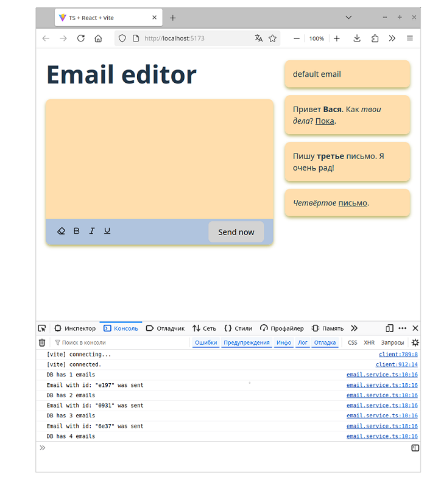

# Info

- Проект `email-editor` (Редактор email-письма)
  
- Написан на TypeScript + React + Vite

- Фейковый REST API создан с импользованием библиотеки **JSON Server**

  - в качестве базы данных создаём файл `db.json` 

  - запускаем сервер командой `npx json-server db.json`

  - после этого сервер будет доступен по адресу `http://localhost:3000`

- Как запустить приложение локально на ПК:

  - клонировать проект с Github
    
  - устанавить все зависимости проекта, перечисленные в файле `package.json`, командой `npm install`
  
  - запустить сервер командой `npx json-server db.json`
  
  - в файле `package.json` есть секция `scripts`, в которой есть скрипт `dev` - он запускает проект 
    в режиме разработчика. Ввести в терминале команду `npm run dev`

далее открываем в браузере указанный адрес `http://localhost:5173/`

- Примеры работы приложения:

Запуск:

Набираем текст письма, редактируем его:

"Отправляем" письмо (по факту емаил никуда не уходит, а просто сохраняется в БД). Справа отображается
список "отправленных" писем:

БД сейчас выглядит так:

---
